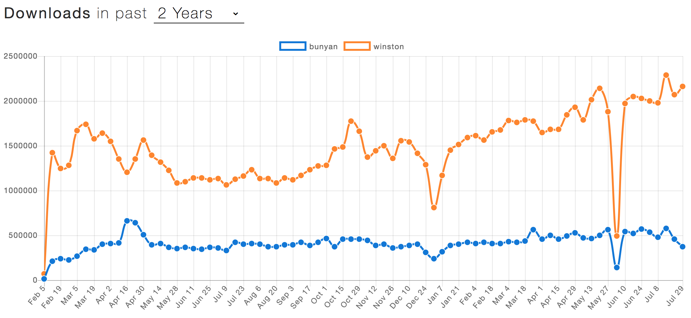

## Setting up Logging

------
- [ ] **Use Winston for logging**
- [ ] **Use Splunk for log analysis**
------

### Winston

[Winston](https://github.com/winstonjs/winston) is a logging utility that supports many "transports" e.g. stdout, file, even network calls. Logs also have different severity levels that are customizable. Winston plays nicely with Splunk.

### Bunyan

[Bunyan](https://github.com/trentm/node-bunyan) is another logging utility. One of the big sells for bunyan is that each line of output is stringified JSON.

### Winston vs. Bunyan

|                     | Winston                                                                      | Bunyan                                                                  | Verdict                                                                              |
| ------------------- | ---------------------------------------------------------------------------- | ----------------------------------------------------------------------- | ------------------------------------------------------------------------------------ |
| Ease of use         | There is some manual configuration of transports required                    | There is out-of-the-box JSON output on every log line                   | Bunyan                                                                               |
| Library maintenance | Actively maintained                                                          | Last commit was June 2017                                               | Winston                                                                              |
| Splunk integration  | [Streaming support](https://www.npmjs.com/package/winston-splunk-httplogger) | [Streaming support](https://www.npmjs.com/package/splunk-bunyan-logger) | Slight advantage for bunyan is that it is referenced on the Splunk site as supported |
| Popularity          | Always has more downloads                                                    | Steady downloads over time                                              | Winston                                                                              |
|                     |                                                                              |                                                                         |                                                                                      |

The recommendation is to use Winston over bunyan because it is actively maintained and has the larger market share, making it a safer bet long-term.

### Splunk

Splunk is used on other back-ends at Merrill and should be used with node applications as well. It allows for analysis on log messages and retrieval of messages.

#### Streaming vs batch

Splunk can either be sent logs via HTTP/HTTPS or by scanning log files periodically.
